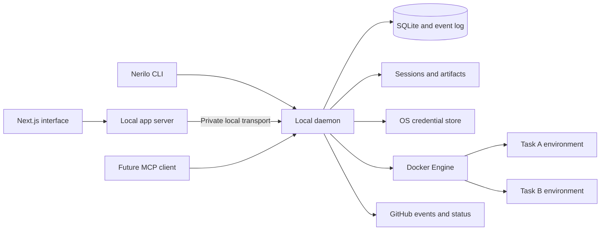

# Nerilo architecture proposal

Status: recommendation, not implemented or benchmarked. 9 September 2026.

## Recommendation

Use Next.js and TypeScript for the app, Bun for the workspace toolchain, and a separate local daemon for durable execution. Start with Docker as the execution target. Treat the application as a client of the daemon, even when they are installed together.

Use Astryx as the component library. A separate [theme package and Next.js preview](../packages/theme/README.md) now proves theme compilation, rendering, and basic interactions under Bun. This is the first implemented design foundation; the daemon and task execution architecture below remain proposals. See [Astryx integration](astryx-integration.md).

Bun documents running Next.js development and production servers. Using Bun to install packages or run scripts does not automatically guarantee every dependency executes under Bun; some scripts retain their Node shebang. Pin and test the chosen runtime explicitly. [Bun Next.js guide](https://bun.sh/guides/ecosystem/nextjs), [Bun runtime](https://bun.sh/docs/runtime).

Next.js can be self-hosted, so the first release need not depend on a hosted control plane. Its server should serve the app and short requests; task execution should not depend on a request remaining open. [Next.js self-hosting](https://nextjs.org/docs/app/guides/self-hosting).

## Deployment shape

The web process and daemon can share one installer and launcher while remaining separately supervised processes. Development hot reload must never restart running tasks.

Initial assumption: the UI and daemon run on the same device, with a local browser connecting to the local app server. If the UI becomes a hosted website, its server cannot reach the user's `localhost`. That requires explicit device pairing and a browser-local bridge or outbound authenticated relay. Do not silently mix those deployment models.

## Ownership boundaries

| Component | Owns |
| --- | --- |
| Web app | Navigation, drafts, task reading, command submission, reconnecting event views |
| Daemon | Task state, command acceptance, queue, scheduler, credentials, runner supervision, Docker access, GitHub synchronization |
| Agent adapter | Launch/resume/interrupt, provider-specific events, session persistence, capability reporting |
| Task environment | Isolated repository clone, toolchain, agent process, verification services, outputs |
| Artifact storage | Retained outputs associated with task, turn, and revision |
| CLI / future MCP | Alternate clients of the same commands and state |

Do not rebuild an agent's reasoning loop in the application. Integrate existing harnesses behind adapters, then normalize their observable lifecycle. A shared interface must expose capability differences such as session forking, interrupt behavior, structured output, and live steering.

## Daemon language

TypeScript on Bun is a reasonable initial candidate and aligns with the preferred stack. Validate subprocess supervision, streaming under load, shutdown, packaged distribution, credential-store access, and recovery on macOS and Linux before treating that choice as final. Rust is a strong alternative if native lifecycle and packaging needs materially favor it. Choosing it solely because “daemons should be Rust” would add a boundary without demonstrated benefit.

Bun workspaces can contain `apps/web`, `apps/daemon`, and `packages/protocol`. Start additional packages only where a real ownership boundary needs them. Keep source under `src/`, use strict TypeScript, and validate incoming data at process boundaries. Runtime data is outside the repository.

## Durable state

Use SQLite in the local daemon with a single write owner, transactions, explicit schema migrations, and an append-only event record plus current-state tables. Store large artifacts and raw session files separately. Backups must capture a consistent database snapshot and the files it references.

Core entities:

- Project: repositories, preparation configuration, defaults, and runtime target.
- Task: user intent, stable ID, parent relationship, completion criteria, and outcome.
- Turn: one accepted input batch and the resulting work.
- Execution: a runner attempt, container identity, session reference, and observed status.
- Event: origin, source identity, task/turn association, revision, sequence, delivery outcome.
- Follow-up: content, queued order, delivery time, and acceptance/delivery state.
- Artifact: file or URL, media type, producing turn, and applicable commit.
- Approval: precise proposed action, applicable revision, and decision.

Task identity survives process replacement. A task can wait for review while its container is stopped. A browser can disconnect while execution continues. A stopped container, interrupted turn, failed execution, and completed task are different states.

## Recovery and delivery

Persist command acceptance before reporting success to a client. Give commands idempotency keys. Persist event sequence numbers so clients can reconnect from a cursor without duplication. Keep bounded snapshots for fast initial loading.

The daemon should reconcile its records with labeled Docker resources at startup. If it crashed after creating a container but before recording success, it should discover and attach to that container rather than create a duplicate. If an agent's session cannot resume, expose the interruption and offer a new attempt with known context; do not promise transparent continuation.

Leases identify the active execution owner. Side effects require reconciliation against authoritative state where possible. Exactly-once arbitrary shell execution is not a realistic promise. Duplicate delivery can be handled; unknown side-effect outcomes must be surfaced rather than blindly replayed.

SQLite storage alone does not supply a reliable workflow engine. Recovery across every significant interruption point is part of the product contract and must be exercised.

## Do we need Temporal?

Nerilo should separate agent and VM lifecycles so work remains accessible when execution stops. A single-machine daemon can start with an explicit persisted state machine and scheduler, provided its crash recovery is properly designed and tested.

Temporal becomes attractive when remote workers, distributed ownership, complex dependencies, and long-running external event loops justify it. Evaluate a mature durable engine before expanding a homegrown scheduler into a distributed platform. This is a deployment and correctness decision, not merely an effort estimate.

If adopting Temporal's TypeScript worker, use its supported Node runtime. The SDK repository explicitly discourages running workers on alternative runtimes such as Bun because of its dependencies on Node-specific behavior. Bun can still manage the monorepo. [Temporal TypeScript runtime support](https://github.com/temporalio/sdk-typescript#nodejs).

## Docker execution

Start with one isolated environment per task, not per conversation message. Retain a task volume across container replacement. Prefer an independent clone in that volume: it avoids exposing the primary checkout and its shared Git metadata to the agent. If local uncommitted changes are included, create a deliberate snapshot, record its provenance, and define how ignored/untracked files and local secrets are handled.

Use prepared images, pinned by digest, and a bounded preparation hook. Capture image build and preparation failures before starting a model turn. Let the daemon create any required sidecar services on a task-specific network; agents should not receive the host Docker socket to provision arbitrary containers themselves.

Allow only declared mounts, bounded CPU/memory/process usage, task-specific credentials, and scoped network access. Bind preview ports to loopback by default and expose preview content on a distinct untrusted origin with no app credentials. A webpage built by an agent must not inherit the control interface's authority.

Docker's documentation treats daemon access as privileged and warns about arbitrary host mounts through provisioning APIs. Enforce these boundaries in the daemon, not by asking the model to obey them. Ordinary containers share a kernel and should not be described as equivalent to per-task VMs for hostile workloads. [Docker security](https://docs.docker.com/engine/security/).

On macOS, account for the Linux VM used by the container runtime, available memory, CPU architecture, file-sharing performance, and Docker being stopped. For projects that need unrestricted nested Docker or stronger isolation, use a separately designed VM-backed execution target rather than weakening the standard task container.

## Local access and credentials

Only the daemon controls Docker. Use a private Unix socket between local processes where supported; the browser communicates with the local app service. Protect that browser-facing service with host/origin checks and authenticated requests. Binding to loopback alone does not establish that a request came from Nerilo.

Pair clients deliberately, keep secrets in the OS credential store, and give task environments only the credentials required for their work. Never return credential values through task APIs or embed them in frontend state. Retained logs and exported sessions need redaction and clear provenance. Credential metadata can explain source, scope, expiry, and which connection needs repair.

Product-level permission to edit a task and permission for an external PR commenter to trigger work are separate. Preserve event author and source, reject unauthorized steering, and do not promote repository text or tool output into trusted instructions.

## GitHub and autonomous follow-up

For an entirely local first release, use rate-aware polling with durable cursors and deduplication. It works without exposing a public port. A future hosted webhook receiver can persist events and deliver them over an outbound daemon connection; that introduces a separate service and must have explicit pairing, retention, and offline semantics.

An event-driven turn needs the source PR, head commit, author, event identifier, and reason for delivery. Revalidate stale checks and resolved review threads before waking an agent. Store ignored and blocked events for explanation. Tie human approval and verification evidence to the exact revision; a new push can invalidate readiness.

When the laptop sleeps, local execution and polling stop progressing. On wake, reconcile missed events and scheduled work with an explicit catch-up policy. Closing the browser should be safe; closing a laptop cannot promise continuous local compute. Remote execution is the later answer to that constraint.

## First end-to-end slice

1. Add a local project and confirm the runtime is ready.
2. Create a task, persist it, and prepare an isolated checkout.
3. Run one selected agent backend and stream normalized activity.
4. Preserve conversation, commands, and outputs through browser refresh.
5. Display changed files, real verification results, and a reviewable artifact.
6. Accept a follow-up and distinguish queueing from interruption.
7. Restart the daemon and recover or clearly account for the task.
8. Add a real PR and react to one authorized review/check event.

Add the second backend after this contract is demonstrated, using its capability differences to test the adapter design. Then add parent/child work, CLI/MCP parity, workflow templates, and remote execution.

## Verification bar

Exercise browser closure, daemon crash during container creation, Docker restart, laptop sleep/wake, disk-full writes, queue retries, duplicate GitHub events, stale PR checks, and unavailable credentials. Verify that an agent cannot control the host Docker daemon, mount another task's files, or reach an authenticated preview/control endpoint beyond its scope.

Success means retained work, truthful status, and recoverable execution. A polished simulated chat by itself does not establish the harness.
